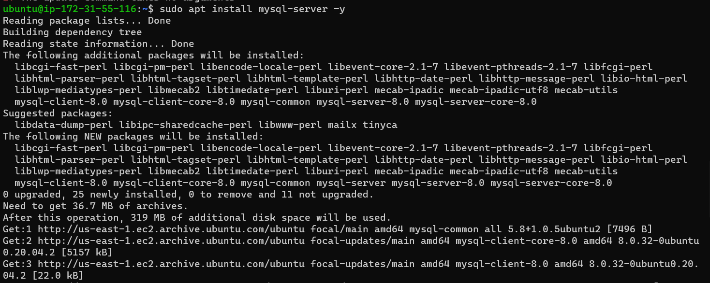
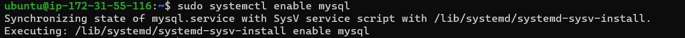
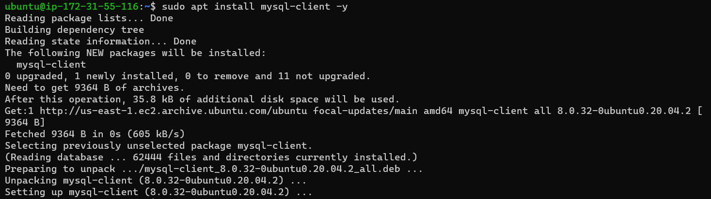
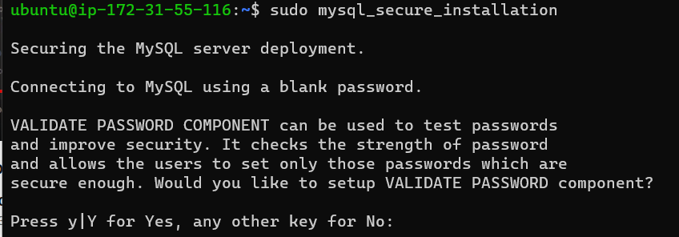
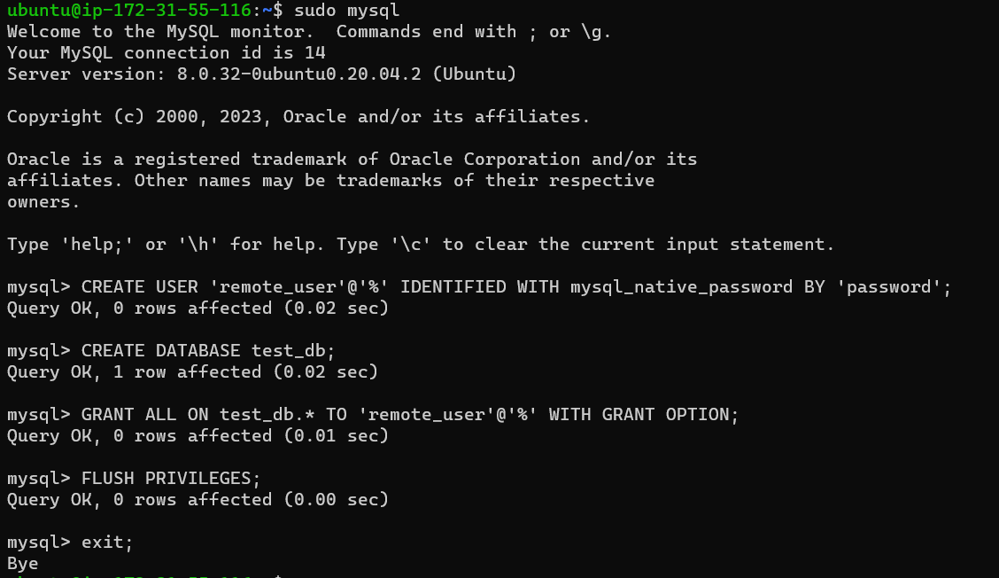
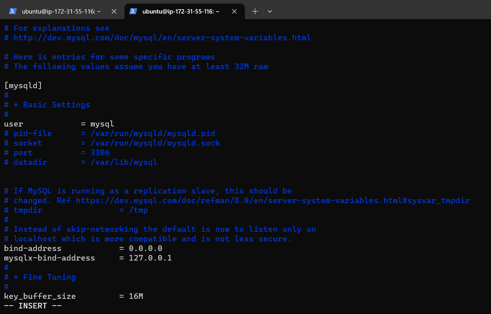
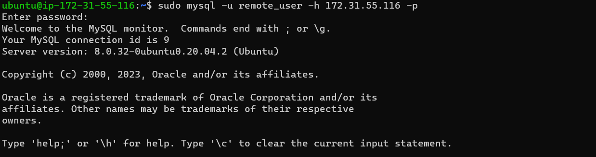
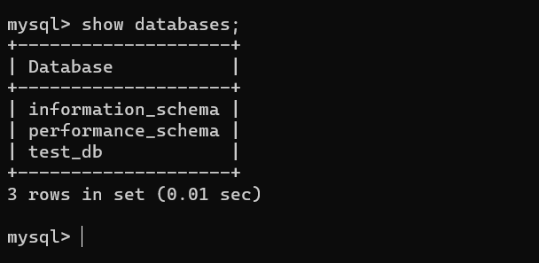

# Project-5

## Documentation for Project 5

# CLIENT-SERVER ARCHITECTURE WITH MYSQL

Understanding Client-Server Architecture

Client-Server refers to an architecture in which two or more computers are connected together over a network to send and receive requests between one another

Install mysql server

enabling mysql 

Run mysql client

By default, both of your EC2 virtual servers are located in the same local virtual network, so they can communicate to each other using local IP addresses. Use mysql server's local IP address to connect from mysql client. MySQL server uses TCP port 3306 by default, so you will have to open it by creating a new entry in ‘Inbound rules’ in ‘mysql server’ Security Groups. For extra security, do not allow all IP addresses to reach your ‘mysql server’ – allow access only to the specific local IP address of your ‘mysql client’.

 configure MySQL server to allow connections from remote hosts.

 

 You might need to configure MySQL server to allow connections from remote hosts.

 

sudo vi /etc/mysql/mysql.conf.d/mysqld.cnf
Replace ‘127.0.0.1’ to ‘0.0.0.0’ like this:

From mysql client Linux Server connect remotely to mysql server Database Engine without using SSH. You must use the mysql utility to perform this action.

Check that you have successfully connected to a remote MySQL server and can perform SQL queries:

Show databases;

